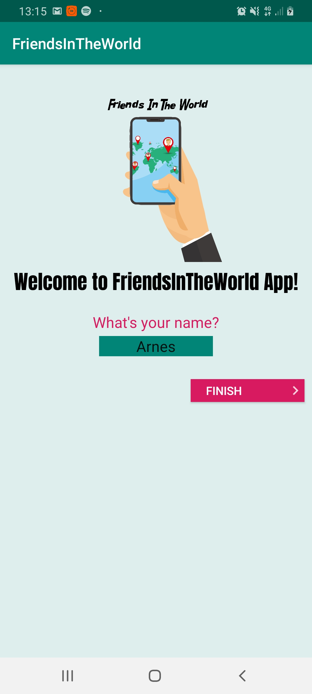
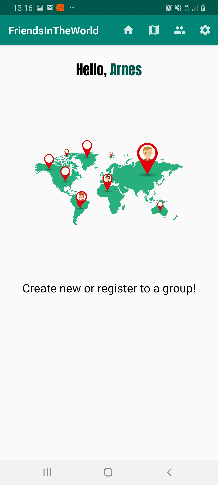
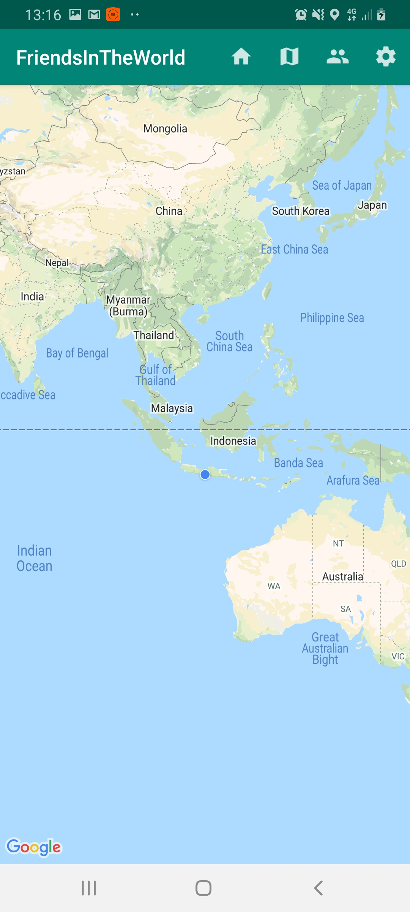
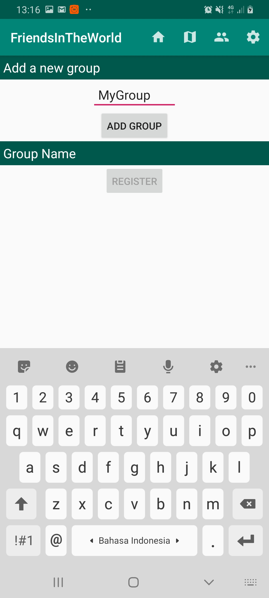
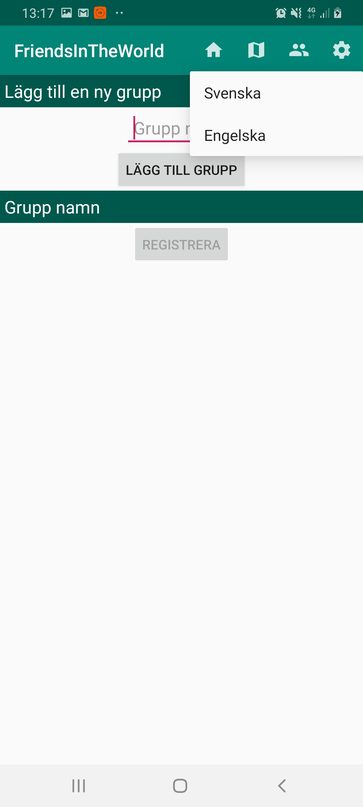
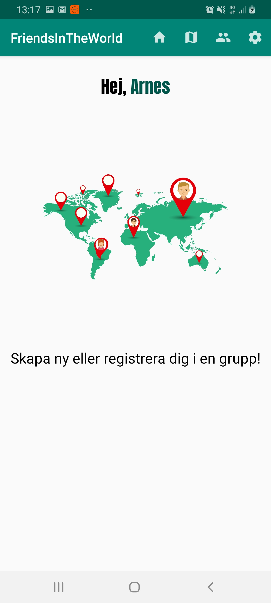

# friends_in_the_world_app
A final project on Android devs course. The app finds a friend's whereabouts and locate them in the world map using Google Maps API. The application also provide localization to Swedish.

